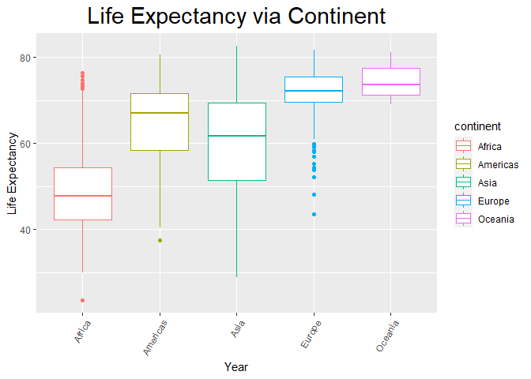
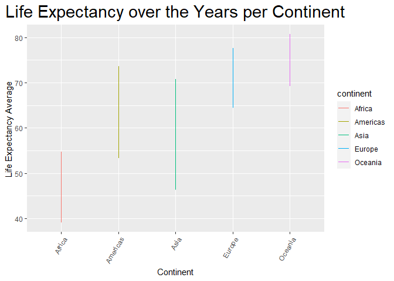
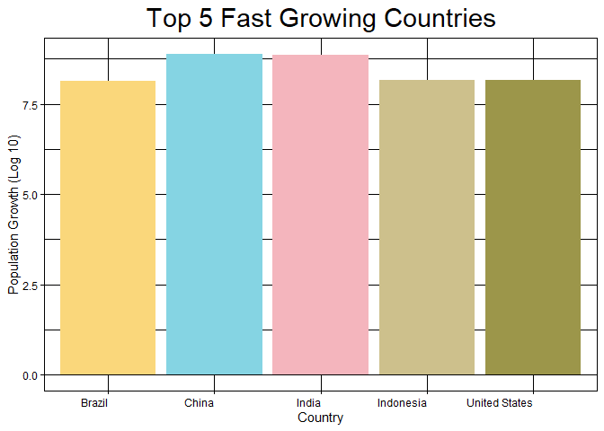
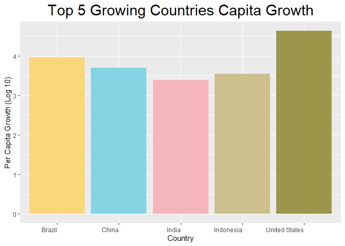

## Instructions
Answer the following questions and complete the exercises in RMarkdown. Please embed all of your code and push your final work to your repository. Your final lab report should be organized, clean, and run free from errors. Remember, you must remove the `#` for the included code chunks to run. Be sure to add your name to the author header above. For any included plots, make sure they are clearly labeled. You are free to use any plot type that you feel best communicates the results of your analysis.  

**In this homework, you should make use of the aesthetics you have learned. It's OK to be flashy!**

Make sure to use the formatting conventions of RMarkdown to make your report neat and clean!  

## Load the libraries

```r
library(tidyverse)
library(janitor)
library(here)
library(naniar)
library(paletteer)
```

## Resources
The idea for this assignment came from [Rebecca Barter's](http://www.rebeccabarter.com/blog/2017-11-17-ggplot2_tutorial/) ggplot tutorial so if you get stuck this is a good place to have a look.  

## Gapminder
For this assignment, we are going to use the dataset [gapminder](https://cran.r-project.org/web/packages/gapminder/index.html). Gapminder includes information about economics, population, and life expectancy from countries all over the world. You will need to install it before use. This is the same data that we will use for midterm 2 so this is good practice.

```r
library("gapminder")
```

## Questions
The questions below are open-ended and have many possible solutions. Your approach should, where appropriate, include numerical summaries and visuals. Be creative; assume you are building an analysis that you would ultimately present to an audience of stakeholders. Feel free to try out different `geoms` if they more clearly present your results.  

**1. Use the function(s) of your choice to get an idea of the overall structure of the data frame, including its dimensions, column names, variable classes, etc. As part of this, determine how NA's are treated in the data.**  

```r
gapminder <- clean_names(gapminder)
names(gapminder)
```

```
## [1] "country"    "continent"  "year"       "life_exp"   "pop"       
## [6] "gdp_percap"
```


```r
summary(gapminder)
```

```
##         country        continent        year         life_exp    
##  Afghanistan:  12   Africa  :624   Min.   :1952   Min.   :23.60  
##  Albania    :  12   Americas:300   1st Qu.:1966   1st Qu.:48.20  
##  Algeria    :  12   Asia    :396   Median :1980   Median :60.71  
##  Angola     :  12   Europe  :360   Mean   :1980   Mean   :59.47  
##  Argentina  :  12   Oceania : 24   3rd Qu.:1993   3rd Qu.:70.85  
##  Australia  :  12                  Max.   :2007   Max.   :82.60  
##  (Other)    :1632                                                
##       pop              gdp_percap      
##  Min.   :6.001e+04   Min.   :   241.2  
##  1st Qu.:2.794e+06   1st Qu.:  1202.1  
##  Median :7.024e+06   Median :  3531.8  
##  Mean   :2.960e+07   Mean   :  7215.3  
##  3rd Qu.:1.959e+07   3rd Qu.:  9325.5  
##  Max.   :1.319e+09   Max.   :113523.1  
## 
```

```r
skimr::skim(gapminder)
```


Table: Data summary

|                         |          |
|:------------------------|:---------|
|Name                     |gapminder |
|Number of rows           |1704      |
|Number of columns        |6         |
|_______________________  |          |
|Column type frequency:   |          |
|factor                   |2         |
|numeric                  |4         |
|________________________ |          |
|Group variables          |None      |


**Variable type: factor**

|skim_variable | n_missing| complete_rate|ordered | n_unique|top_counts                             |
|:-------------|---------:|-------------:|:-------|--------:|:--------------------------------------|
|country       |         0|             1|FALSE   |      142|Afg: 12, Alb: 12, Alg: 12, Ang: 12     |
|continent     |         0|             1|FALSE   |        5|Afr: 624, Asi: 396, Eur: 360, Ame: 300 |


**Variable type: numeric**

|skim_variable | n_missing| complete_rate|        mean|           sd|       p0|        p25|        p50|         p75|         p100|hist  |
|:-------------|---------:|-------------:|-----------:|------------:|--------:|----------:|----------:|-----------:|------------:|:-----|
|year          |         0|             1|     1979.50|        17.27|  1952.00|    1965.75|    1979.50|     1993.25|       2007.0|▇▅▅▅▇ |
|life_exp      |         0|             1|       59.47|        12.92|    23.60|      48.20|      60.71|       70.85|         82.6|▁▆▇▇▇ |
|pop           |         0|             1| 29601212.32| 106157896.74| 60011.00| 2793664.00| 7023595.50| 19585221.75| 1318683096.0|▇▁▁▁▁ |
|gdp_percap    |         0|             1|     7215.33|      9857.45|   241.17|    1202.06|    3531.85|     9325.46|     113523.1|▇▁▁▁▁ |

```r
gapminder
```

```
## # A tibble: 1,704 x 6
##    country     continent  year life_exp      pop gdp_percap
##    <fct>       <fct>     <int>    <dbl>    <int>      <dbl>
##  1 Afghanistan Asia       1952     28.8  8425333       779.
##  2 Afghanistan Asia       1957     30.3  9240934       821.
##  3 Afghanistan Asia       1962     32.0 10267083       853.
##  4 Afghanistan Asia       1967     34.0 11537966       836.
##  5 Afghanistan Asia       1972     36.1 13079460       740.
##  6 Afghanistan Asia       1977     38.4 14880372       786.
##  7 Afghanistan Asia       1982     39.9 12881816       978.
##  8 Afghanistan Asia       1987     40.8 13867957       852.
##  9 Afghanistan Asia       1992     41.7 16317921       649.
## 10 Afghanistan Asia       1997     41.8 22227415       635.
## # ... with 1,694 more rows
```

```r
naniar::miss_var_summary(gapminder)
```

```
## # A tibble: 6 x 3
##   variable   n_miss pct_miss
##   <chr>       <int>    <dbl>
## 1 country         0        0
## 2 continent       0        0
## 3 year            0        0
## 4 life_exp        0        0
## 5 pop             0        0
## 6 gdp_percap      0        0
```


**2. Among the interesting variables in gapminder is life expectancy. How has global life expectancy changed between 1952 and 2007?**

```r
gapminder$year <- as.factor(gapminder$year)
life_expectancy <- gapminder %>%
  group_by(year) %>%
  summarize(mean_life_expectancy = mean(life_exp))
  
life_expectancy
```

```
## # A tibble: 12 x 2
##    year  mean_life_expectancy
##  * <fct>                <dbl>
##  1 1952                  49.1
##  2 1957                  51.5
##  3 1962                  53.6
##  4 1967                  55.7
##  5 1972                  57.6
##  6 1977                  59.6
##  7 1982                  61.5
##  8 1987                  63.2
##  9 1992                  64.2
## 10 1997                  65.0
## 11 2002                  65.7
## 12 2007                  67.0
```

```r
life_expectancy %>%
  ggplot(aes(x=year, y= mean_life_expectancy, color = year))+
  geom_point()+
 theme(axis.text.x = element_text(angle = 60, hjust = 1), plot.title = element_text(size = rel(2), hjust = .5)) +
  labs(title = "Average Global Life Expectancy",
       x = "Year",
       y= "Age")
```

<!-- -->
The global life expetancy has increased between 1952 and 2007

**3. How do the distributions of life expectancy compare for the years 1952 and 2007?**

```r
gapminder %>%
  filter (year == 1952 | year == 2007) %>%
  ggplot(aes(x= year, y= life_exp)) + 
  geom_boxplot()+
  theme(axis.text.x = element_text(angle = 60, hjust = 1), plot.title = element_text(size = rel(2), hjust = .5)) +
  labs(title = "1952 vs 2007 Global Life Expectancy",
       x = "Year",
       y= "Age")
```

<!-- -->

**4. Your answer above doesn't tell the whole story since life expectancy varies by region. Make a summary that shows the min, mean, and max life expectancy by continent for all years represented in the data.**

```r
gapminder%>%
  group_by(year,continent)%>%
  summarise(mean_life_exp=mean(life_exp),
            max_life_exp=max(life_exp),
            minn_life_exp=min(life_exp))
```

```
## `summarise()` has grouped output by 'year'. You can override using the `.groups` argument.
```

```
## # A tibble: 60 x 5
## # Groups:   year [12]
##    year  continent mean_life_exp max_life_exp minn_life_exp
##    <fct> <fct>             <dbl>        <dbl>         <dbl>
##  1 1952  Africa             39.1         52.7          30  
##  2 1952  Americas           53.3         68.8          37.6
##  3 1952  Asia               46.3         65.4          28.8
##  4 1952  Europe             64.4         72.7          43.6
##  5 1952  Oceania            69.3         69.4          69.1
##  6 1957  Africa             41.3         58.1          31.6
##  7 1957  Americas           56.0         70.0          40.7
##  8 1957  Asia               49.3         67.8          30.3
##  9 1957  Europe             66.7         73.5          48.1
## 10 1957  Oceania            70.3         70.3          70.3
## # ... with 50 more rows
```

```r
gapminder%>%
  group_by(continent) %>%
  ggplot(aes(x=continent,y=life_exp,  color = continent))+
  geom_boxplot()+
  theme(axis.text.x = element_text(angle = 60, hjust = 1), plot.title = element_text(size = rel(2), hjust = .5)) +
  labs(title = "Life Expectancy via Continent",
       x = "Year",
       y= "Life Expectancy")
```

<!-- -->
<style>
div.blue { background-color:#e6f0ff; border-radius: 5px; padding: 20px;}
</style>
<div class = "blue">

**5. How has life expectancy changed between 1952-2007 for each continent?**

```r
gapminder %>%
  group_by(year, continent) %>%
  summarize(life_expt = mean(life_exp)) %>%
  ggplot(aes(x= continent, y= life_expt, color = continent))+
  geom_line()+
 theme(axis.text.x = element_text(angle = 60, hjust = 1), plot.title = element_text(size = rel(2), hjust = .5)) +
  labs(title = "Life Expectancy over the Years per Continent",
       x = "Continent",
       y= "Life Expectancy Average ")
```

```
## `summarise()` has grouped output by 'year'. You can override using the `.groups` argument.
```

<!-- -->
</div>

**6. We are interested in the relationship between per capita GDP and life expectancy; i.e. does having more money help you live longer?**

```r
palette <- paletteer_d("wesanderson::Moonrise3")
```

```r
money <- gapminder %>%
  ggplot(aes(x= log10(gdp_percap), y= life_exp, color = continent)) +
  geom_point(size = 1, na.rm = T) +
  scale_color_manual(values = palette) +
  theme(axis.text.x = element_text(hjust = 1), plot.title = element_text(size = rel(2), hjust = .5)) +
  labs(title = "GDP vs Life Expectancy",
       x = "Log 10 of per Capita GPP",
       y= "Life Expectancy Average")
money
```

<!-- -->

**7. Which countries have had the largest population growth since 1952?**

```r
growth <- gapminder %>% 
  group_by(country) %>% 
  filter(year=="1952"|year=="2007") %>% 
  mutate(pop_growth= pop-lag(pop, default=first(pop))) %>% 
  arrange(desc(pop_growth))
growth
```

```
## # A tibble: 284 x 7
## # Groups:   country [142]
##    country       continent year  life_exp        pop gdp_percap pop_growth
##    <fct>         <fct>     <fct>    <dbl>      <int>      <dbl>      <int>
##  1 China         Asia      2007      73.0 1318683096      4959.  762419569
##  2 India         Asia      2007      64.7 1110396331      2452.  738396331
##  3 United States Americas  2007      78.2  301139947     42952.  143586947
##  4 Indonesia     Asia      2007      70.6  223547000      3541.  141495000
##  5 Brazil        Americas  2007      72.4  190010647      9066.  133408087
##  6 Pakistan      Asia      2007      65.5  169270617      2606.  127924057
##  7 Bangladesh    Asia      2007      64.1  150448339      1391.  103561480
##  8 Nigeria       Africa    2007      46.9  135031164      2014.  101912068
##  9 Mexico        Americas  2007      76.2  108700891     11978.   78556574
## 10 Philippines   Asia      2007      71.7   91077287      3190.   68638596
## # ... with 274 more rows
```

**8. Use your results from the question above to plot population growth for the top five countries since 1952.**

```r
growth %>%
filter(pop_growth>=133408087) %>%
  ggplot(aes(x=country, y= log10(pop_growth)))+
  geom_col(fill = palette)+
  theme_linedraw()+
  theme(axis.text.x = element_text(hjust = 1), plot.title = element_text(size = rel(2), hjust = .5)) +
  labs(title = "Top 5 Fast Growing Countries",
       x = "Country",
       y= "Population Growth (Log 10)")
```

<!-- -->

**9. How does per-capita GDP growth compare between these same five countries?**

```r
growth %>%
filter(pop_growth>=133408087) %>%
  ggplot(aes(x=country, y= log10(gdp_percap)))+
  geom_col(fill = palette) +
  theme(axis.text.x = element_text(hjust = 1), plot.title = element_text(size = rel(2), hjust = .5)) +
  labs(title = "Top 5 Growing Countries Capita Growth",
       x = "Country",
       y= "Per Capita Growth (Log 10)")
```

<!-- -->

**10. Make one plot of your choice that uses faceting!**

```r
gapminder %>%
  filter(continent == "Americas") %>%
ggplot(aes(x=log10(gdp_percap), color = country))+
  geom_density()+
  facet_wrap(~country)+
  theme(axis.text.x = element_text(hjust = 1), plot.title = element_text(size = rel(2), hjust = .5)) +
  labs(title = "Per Capita Growth in the Americas",
       x = "GDP per capita")
```

<!-- -->

## Push your final code to GitHub!
Please be sure that you check the `keep md` file in the knit preferences. 
