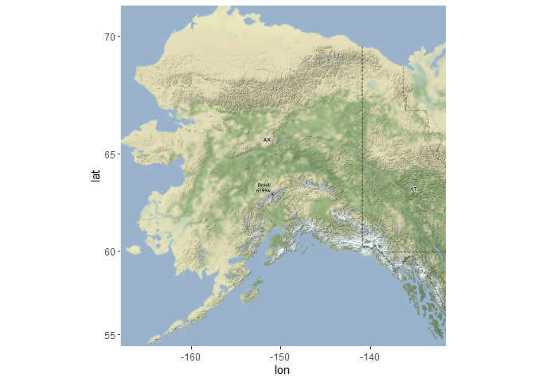

## Instructions
Answer the following questions and complete the exercises in RMarkdown. Please embed all of your code and push your final work to your repository. Your final lab report should be organized, clean, and run free from errors. Remember, you must remove the `#` for the included code chunks to run. Be sure to add your name to the author header above. For any included plots, make sure they are clearly labeled. You are free to use any plot type that you feel best communicates the results of your analysis.  

Make sure to use the formatting conventions of RMarkdown to make your report neat and clean!  

## Load the libraries

```r
library(tidyverse)
library(janitor)
library(here)
library(ggmap)
library(albersusa)
```

## Load the Data
We will use two separate data sets for this homework.  

1. The first [data set](https://rcweb.dartmouth.edu/~f002d69/workshops/index_rspatial.html) represent sightings of grizzly bears (Ursos arctos) in Alaska.  
2. The second data set is from Brandell, Ellen E (2021), Serological dataset and R code for: Patterns and processes of pathogen exposure in gray wolves across North America, Dryad, [Dataset](https://doi.org/10.5061/dryad.5hqbzkh51).  

1. Load the `grizzly` data and evaluate its structure. As part of this step, produce a summary that provides the range of latitude and longitude so you can build an appropriate bounding box.

```r
grizzly <- readr::read_csv("data/bear-sightings.csv")
```

```
## 
## -- Column specification --------------------------------------------------------
## cols(
##   bear.id = col_double(),
##   longitude = col_double(),
##   latitude = col_double()
## )
```


```r
glimpse(grizzly)
```

```
## Rows: 494
## Columns: 3
## $ bear.id   <dbl> 7, 57, 69, 75, 104, 108, 115, 116, 125, 135, 137, 162, 185, ~
## $ longitude <dbl> -148.9560, -152.6228, -144.9374, -152.8485, -143.2948, -149.~
## $ latitude  <dbl> 62.65822, 58.35064, 62.38227, 59.90122, 61.07311, 62.91605, ~
```


```r
grizzly %>% 
  select(latitude, longitude) %>% 
  summary()
```

```
##     latitude       longitude     
##  Min.   :55.02   Min.   :-166.2  
##  1st Qu.:58.13   1st Qu.:-154.2  
##  Median :60.97   Median :-151.0  
##  Mean   :61.41   Mean   :-149.1  
##  3rd Qu.:64.13   3rd Qu.:-145.6  
##  Max.   :70.37   Max.   :-131.3
```

2. Use the range of the latitude and longitude to build an appropriate bounding box for your map.

```r
latitude <- c(55.02, 70.37)
longitude <- c(-166.2, -133.3)
bbox <- make_bbox(longitude, latitude, f=0.05)
```

3. Load a map from `stamen` in a terrain style projection and display the map.

```r
map1 <- get_map(bbox, maptype = "terrain", source= "stamen")
```

```
## Source : http://tile.stamen.com/terrain/5/1/6.png
```

```
## Source : http://tile.stamen.com/terrain/5/2/6.png
```

```
## Source : http://tile.stamen.com/terrain/5/3/6.png
```

```
## Source : http://tile.stamen.com/terrain/5/4/6.png
```

```
## Source : http://tile.stamen.com/terrain/5/1/7.png
```

```
## Source : http://tile.stamen.com/terrain/5/2/7.png
```

```
## Source : http://tile.stamen.com/terrain/5/3/7.png
```

```
## Source : http://tile.stamen.com/terrain/5/4/7.png
```

```
## Source : http://tile.stamen.com/terrain/5/1/8.png
```

```
## Source : http://tile.stamen.com/terrain/5/2/8.png
```

```
## Source : http://tile.stamen.com/terrain/5/3/8.png
```

```
## Source : http://tile.stamen.com/terrain/5/4/8.png
```

```
## Source : http://tile.stamen.com/terrain/5/1/9.png
```

```
## Source : http://tile.stamen.com/terrain/5/2/9.png
```

```
## Source : http://tile.stamen.com/terrain/5/3/9.png
```

```
## Source : http://tile.stamen.com/terrain/5/4/9.png
```

```
## Source : http://tile.stamen.com/terrain/5/1/10.png
```

```
## Source : http://tile.stamen.com/terrain/5/2/10.png
```

```
## Source : http://tile.stamen.com/terrain/5/3/10.png
```

```
## Source : http://tile.stamen.com/terrain/5/4/10.png
```


```r
ggmap(map1)
```

<!-- -->

4. Build a final map that overlays the recorded observations of grizzly bears in Alaska.

```r
ggmap(map1)+
  geom_point(data = grizzly, aes(longitude, latitude))+
  labs(x="Longitude", y="Latitude", title="Grizzly Bear Observations")
```

```
## Warning: Removed 3 rows containing missing values (geom_point).
```

<!-- -->

5. Let's switch to the wolves data. Load the data and evaluate its structure.

```r
wolf_data <- readr::read_csv("data/wolves_data/wolves_dataset.csv")
```

```
## 
## -- Column specification --------------------------------------------------------
## cols(
##   .default = col_double(),
##   pop = col_character(),
##   age.cat = col_character(),
##   sex = col_character(),
##   color = col_character()
## )
## i Use `spec()` for the full column specifications.
```

```r
wolf_data %>% 
  select(lat, long) %>% 
  summary()
```

```
##       lat             long        
##  Min.   :33.89   Min.   :-157.84  
##  1st Qu.:44.60   1st Qu.:-123.73  
##  Median :46.83   Median :-110.99  
##  Mean   :50.43   Mean   :-116.86  
##  3rd Qu.:57.89   3rd Qu.:-110.55  
##  Max.   :80.50   Max.   : -82.42
```

6. How many distinct wolf populations are included in this study? Mae a new object that restricts the data to the wolf populations in the lower 48 US states.

```r
n_distinct(wolf_data$pop)
```

```
## [1] 17
```


```r
wolf_restrict <- wolf_data %>%
  filter(lat<= 48)
```

7. Use the `albersusa` package to make a base map of the lower 48 US states.

```r
us_map <-usa_sf()
```


```r
ggplot() +
  geom_sf(data=us_map, size = 0.5) +
  theme_linedraw() +
  labs(title="USA", x="Longitude", y="Latitude" )
```

<!-- -->


8. Use the relimited data to plot the distribution of wolf populations in the lower 48 US states.

```r
ggplot() +
  geom_sf(data = us_map, size = .5) +
  geom_point(data = wolf_restrict, aes(long, lat))+
  labs(x = "Figure 1: Distribution of Wolves in Lower 48 States")+
  theme_minimal() +
  theme(axis.text = element_blank()) +
  theme(axis.title.x = element_text(hjust=0.5, size = 10)) +
  theme(axis.title.y = element_blank()) +
  theme(panel.grid = element_blank()) +
  theme(legend.position = c(0.9, 0.3))
```

<!-- -->

9. What is the average pack size for the wolves in this study by region?

```r
wolf_restrict %>%
  group_by(pop) %>%
   summarize(average_pack_size=mean(pack.size)) %>% 
  arrange(desc(average_pack_size))
```

```
## # A tibble: 6 x 2
##   pop     average_pack_size
##   <chr>               <dbl>
## 1 YNP                  8.25
## 2 GTNP                 8.1 
## 3 MI                   7.12
## 4 MT                   5.62
## 5 SNF                  4.81
## 6 MEXICAN              4.04
```

10. Make a new map that shows the distribution of wolves in the lower 48 US states but which has the size of location markers adjusted by pack size.

```r
ggplot() +
  geom_sf(data = us_map, size = .5) +
  geom_point(data = wolf_restrict, aes(long, lat, size = pack.size))+
  labs(x = "Figure 1: Distribution of Wolves in Lower 48 States")+
  theme_minimal() +
  theme(axis.text = element_blank()) +
  theme(axis.title.x = element_text(hjust=0.5, size = 10)) +
  theme(axis.title.y = element_blank()) +
  theme(panel.grid = element_blank()) +
  theme(legend.position = c(0.9, 0.3))
```

<!-- -->

## Push your final code to GitHub!
Please be sure that you check the `keep md` file in the knit preferences. 
